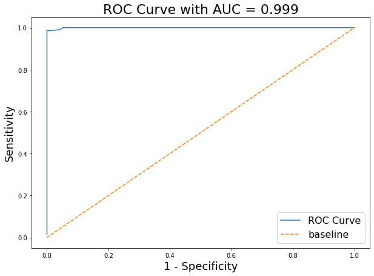

## NLP Project
### Prediction between McDonald's and Burger King Subreddits 

In this project we collected posts from 2 subreddits and trained few prediction models. Two subreddits we chose were McDonald's 
and Burger King. Pur purpose is to designing classification models to identify the correct class of the posts between McDonald’s and Burger King subreddits 

### Step 1 - Data Collection

 We used Pushshift API at  https://api.pushshift.io/reddit/search/comment/ address to gather data. We set the parameters as "McDonald's" and "Burger King". Each time we send a request to gather data, we could only receive 500 posts maximum. That is why we tried this process 12 times. In total we had 6,000 posts from both subreddits.
Once we gathered all the data, we combined them in a DataFrame and exported as a CSV file.
 
 
### Step 2 - Modeling

This second step also includes data cleaning and EDA. We dropped "removed" and "deleted" columns.  With this process our number of records dropped to little over 5,000 posts. We conducted 6 analysis with 3 estimator and 1 transformer tools.
In the first notebook, 02_data_models, you can see 3 models.
Our first model is Multinomial Naive Bayes. We used term frequency–inverse document frequency vectorizer to transform the data. Both the transformer and the estimator were instantiated in the Pipeline. With a group parameters, we used GridSearchCV. 
These hyperparamteres were passed into the GridSearchCV:
`English` and `none` for stopwords;  `(1,1)` and `(1,2)` for ngram_range for vectorizer. Also alpha values for Multinomial Naive Bayes 0.01, 0.1, and 1. GridSearch process fit 60 models to our data. 

Our second model is K-Nearest Neighbors. We used the same vectorizer to transform the data. Both the transformer and the estimator were instantiated in the Pipeline. We passed a group of hyperparameters to GridSearchCV. The hyperparamteres that we passed `English` and `none` for stopwords; `(1,1)`, `(1,2)` and `(1,3)` for ngram_range for vectorizer. Also we included k=3, k=5, and k=7 as hyperparameters for KNN model. Additionally, we searched for Manhattan and Eucledian distances. Our gridsearch process fit 108 models to our data.

Our third choice of estimator is Logistic Regression. Just like in the previous models we used Pipeline nad Gridsearch in order to find the best parameters. We passed `English` and `none` for stopwords in the same vectorizer. Also, for ngram_range we passes `(1,1)`, `(1,2)` and `(1,3)`. For estimator Hyperparameters, we included both regularizations (Ridge and Lasso). Also, C value choices were 5.5 and 6 as hyperparameters.

In the second notebook, we manually created stop_words list.
stop_words = ["McDonalds", "McDonald's", "whopper", "Big Mac", "King", "loving", "BK"]

We used exact same transformer and estimators with the first notebook. Only difference is we use this manually created stop_words instead of `none`. We kept `English` as an alternative parameter in the GridSearch.

---

### The Results and Conclusion

Model Number | Transformer|Estimator|Best Score|Testing Data Score|ROC_AUC Score|Sensitivity |	Specificity Score
|---|---|-------------|------------|-------------|-----------------------|----------|-------------|
1|TF-IDF Vectorizer|Multinomial Naive Bayes|98%|99%|99%|98%|100%
2|TF-IDF Vectorizer|K-Nearest Neighbors|97%|99%|99.5%|99%|99.5%
3|TF-IDF Vectorizer|Logistic Regression|99%|97%|99%|98%|99.5%
4|TF-IDF Vectorizer|Multinomial Naive Bayes*|99%|99%|99%|100%|99%
5|TF-IDF Vectorizer|K-Nearest Neighbors*|98%|99%|99%|99%|100%
6|TF-IDF Vectorizer|Logistic Regression*|99%|99%|100%|99%|99%

(*) Stopwords was passed as parameter.

We can see that all of the models are very close to perfect accuracy. 

 The best hyperparameters for the first model are;
 >'alpha': 0.01  => for estimator   
 'ngram_range': (1, 2)  => for transformer  
 'tfdif__stop_words': 'english'  => for transformer  
 
 
 You can see the ROC_AUC curve below.
 
 

In the second model our best parameters are;

 >'knn__n_neighbors': 3 
 'knn__p': 1
 'tfdif__ngram_range': (1, 1)
 'tfdif__stop_words': 'english'  

In the third model our best parameters are; 
>'lr__C': 5.5    
 'lr__penalty': 'l1'    
 'lr__solver': 'liblinear'    
 'tfdif__ngram_range': (1, 1)    
 'tfdif__stop_words': 'english'  

In the forth , fifth and sixth models, the only difference was adding manually created stop words as parameters instead of `none`.
Our GridsearchCV has chosen this manually created stopwords over `English`.

